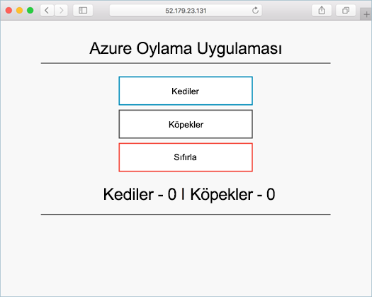

# <a name="tutorial-run-applications-in-azure-kubernetes-service-aks"></a>Öğretici: Azure Kubernetes Hizmeti’nde (AKS) uygulamaları çalıştırma

Kubernetes, kapsayıcılı uygulamalar için dağıtılmış bir platform sunar. Kendi uygulamalarınızı ve hizmetlerinizi oluşturup bir Kubernetes kümesine dağıtırsınız, kullanılabilirlik ve bağlantı özellikleri de küme tarafından yönetilir. Yedi bölümün dördüncüsü olan bu öğreticide Kubernetes kümesine örnek bir uygulama dağıtılır. Aşağıdakileri nasıl yapacağınızı öğrenirsiniz:

> [!div class="checklist"]
> * Kubernetes bildirim dosyasını güncelleştirme
> * Kubernetes'te uygulama çalıştırma
> * Uygulamayı test etme

Ek öğreticilerde, bu uygulama genişletilebilir ve güncelleştirilir.

Bu hızlı başlangıç, Kubernetes kavramlarının temel olarak bilindiğini varsayar. Daha fazla bilgi için bkz. [Azure Kubernetes hizmeti (AKS) Için Kubernetes temel kavramları][kubernetes-concepts].

## <a name="before-you-begin"></a>Başlamadan önce

Önceki öğreticilerde, bir uygulama bir kapsayıcı görüntüsüne paketlendi, görüntü Azure Container Registry’ye yüklendi ve bir Kubernetes kümesi oluşturuldu.

Bu öğreticiyi tamamlamak için önceden oluşturulmuş `azure-vote-all-in-one-redis.yaml` Kubernetes bildirim dosyasına ihtiyaç duyarsınız. Bu dosya, önceki öğreticide uygulama kaynak koduyla indirildi. Depoyu Klonladığınız ve dizinleri kopyalanmış depoya değiştirdiğinizi doğrulayın. Bu adımları tamamlamadıysanız ve takip etmek istiyorsanız, [öğretici 1 – kapsayıcı görüntüleri oluşturma][aks-tutorial-prepare-app]ile başlayın.

Bu öğreticide, Azure CLı sürüm 2.0.53 veya üstünü çalıştırıyor olmanız gerekir. Sürümü bulmak için `az --version` komutunu çalıştırın. Yükleme veya yükseltme yapmanız gerekiyorsa bkz. [Azure CLI'yı yükleme][azure-cli-install].

## <a name="update-the-manifest-file"></a>Bildirim dosyasını güncelleştirme

Bu öğreticilerde Azure Container Registry (ACR) örneği, örnek uygulamanın kapsayıcı görüntüsünü depolar. Uygulamayı dağıtmak için Kubernetes bildirim dosyası içindeki görüntü adını ACR oturum açma sunucusu adını içerecek şekilde güncelleştirmeniz gerekir.

[Az ACR List][az-acr-list] komutunu kullanarak ACR oturum açma sunucusu adını aşağıdaki gibi alın:

```azurecli
az acr list --resource-group myResourceGroup --query "[].{acrLoginServer:loginServer}" --output table
```

İlk öğreticide kopyalanan git deposundaki örnek bildirim dosyasında oturum açma sunucusu adı olarak *microsoft* kullanılmıştır. Kopyalanmış *Azure-oylama-App-redsıs* dizininde olduğunuzdan emin olun, sonra bildirim dosyasını `vi`gibi bir metin düzenleyicisiyle açın:

```console
vi azure-vote-all-in-one-redis.yaml
```

*microsoft* yerine ACR oturum açma sunucunuzun adını yazın. Görüntü adı, bildirim dosyasının 51. satırında bulunur. Aşağıdaki örnekte varsayılan görüntü adı gösterilir:

```yaml
containers:
- name: azure-vote-front
  image: microsoft/azure-vote-front:v1
```

Kendi ACR oturum açma sunucunuzun adını girerek bildirim dosyanızın aşağıdaki örnekte olduğu gibi görünmesini sağlayın:

```yaml
containers:
- name: azure-vote-front
  image: <acrName>.azurecr.io/azure-vote-front:v1
```

Dosyayı kaydedin ve kapatın. `vi``:wq`kullanın.

## <a name="deploy-the-application"></a>Uygulamayı dağıtma

Uygulamanızı dağıtmak için [kubectl Apply][kubectl-apply] komutunu kullanın. Bu komut, bildirim dosyasını ayrıştırır ve tanımlanmış Kubernetes nesnelerini oluşturur. Aşağıdaki örnekte gösterildiği gibi örnek bildirim dosyasının adını belirtin:

```console
kubectl apply -f azure-vote-all-in-one-redis.yaml
```

Aşağıdaki örnek çıktıda, AKS kümesinde başarıyla oluşturulan kaynaklar gösterilmektedir:

```
$ kubectl apply -f azure-vote-all-in-one-redis.yaml

deployment "azure-vote-back" created
service "azure-vote-back" created
deployment "azure-vote-front" created
service "azure-vote-front" created
```

## <a name="test-the-application"></a>Uygulamayı test etme

Uygulama çalıştığında, bir Kubernetes hizmeti, uygulamanın ön ucuna internet 'e koyar. Bu işlemin tamamlanması birkaç dakika sürebilir.

İlerleme durumunu izlemek için [kubectl get service][kubectl-get] komutunu `--watch` bağımsız değişkeniyle birlikte kullanın.

```console
kubectl get service azure-vote-front --watch
```

Başlangıçta *Azure-oyönme* hizmeti IÇIN *dış IP* , *Beklemede*olarak gösterilir:

```
azure-vote-front   LoadBalancer   10.0.34.242   <pending>     80:30676/TCP   5s
```

*Dış IP* adresi *bekliyor* durumundan gerçek bir genel IP adresi olarak değiştiğinde, `kubectl` izleme işlemini durdurmak için `CTRL-C` kullanın. Aşağıdaki örnek çıktıda, hizmete atanmış geçerli bir genel IP adresi gösterilmektedir:

```
azure-vote-front   LoadBalancer   10.0.34.242   52.179.23.131   80:30676/TCP   67s
```

Uygulamayı eylemde görmek için, hizmetinizin dış IP adresine bir Web tarayıcısı açın:



Uygulama yüklenmediyse, görüntü kayıt defterinizde bir yetkilendirme sorunundan kaynaklanıyor olabilir. Kapsayıcılarınızın durumunu görüntülemek için `kubectl get pods` komutunu kullanın. Kapsayıcı görüntüleri çekemediği takdirde bkz. [Azure Kubernetes hizmetinden Azure Container Registry kimlik doğrulaması](cluster-container-registry-integration.md).

## <a name="next-steps"></a>Sonraki adımlar

Bu öğreticide, AKS 'teki bir Kubernetes kümesine örnek bir Azure oy uygulaması dağıtıldı. Şunları öğrendiniz:

> [!div class="checklist"]
> * Kubernetes bildirim dosyalarını güncelleştirme
> * Kubernetes'te uygulama çalıştırma
> * Uygulamayı test etme

Kubernetes uygulamasını ve temel alınan Kubernetes altyapısını ölçeklendirme hakkında daha fazla bilgi için sonraki öğreticiye ilerleyin.

> [!div class="nextstepaction"]
> [Kubernetes uygulamasını ve altyapısını ölçeklendirme][aks-tutorial-scale]

<!-- LINKS - external -->
[kubectl-apply]: https://kubernetes.io/docs/reference/generated/kubectl/kubectl-commands#apply
[kubectl-create]: https://kubernetes.io/docs/reference/generated/kubectl/kubectl-commands#create
[kubectl-get]: https://kubernetes.io/docs/reference/generated/kubectl/kubectl-commands#get

<!-- LINKS - internal -->
[aks-tutorial-prepare-app]: ./tutorial-kubernetes-prepare-app.md
[aks-tutorial-scale]: ./tutorial-kubernetes-scale.md
[az-acr-list]: /cli/azure/acr
[azure-cli-install]: /cli/azure/install-azure-cli
[kubernetes-concepts]: concepts-clusters-workloads.md
[kubernetes-service]: concepts-network.md#services
