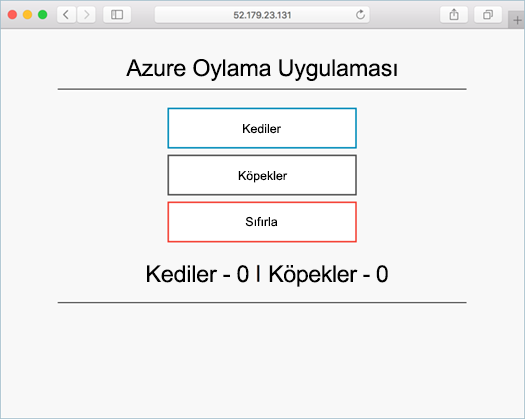

# <a name="tutorial-prepare-an-application-for-azure-kubernetes-service-aks"></a>Öğretici: Azure Kubernetes Hizmeti (AKS) için uygulamayı hazırlama

Bu yedi parçalık öğreticinin ilk bölümünde, bir çoklu kapsayıcı uygulaması Kubernetes’te kullanılmak üzere hazırlanmaktadır. Uygulamayı yerel ortamda derlemek ve test etmek için Docker Compose gibi var olan geliştirme araçları kullanılmaktadır. Aşağıdakileri nasıl yapacağınızı öğrenirsiniz:

> [!div class="checklist"]
> * Örnek bir uygulama kaynağını GitHub’dan kopyalama
> * Örnek uygulama kaynağından kapsayıcı görüntüsü oluşturma
> * Çok kapsayıcılı uygulamayı yerel bir Docker ortamında test etme

Tamamlandıktan sonra, aşağıdaki uygulama yerel geliştirme ortamınızda çalışacaktır:



Ek öğreticilerde, kapsayıcı görüntüsü bir Azure Container Registry yüklenir ve ardından bir AKS kümesine dağıtılır.

## <a name="before-you-begin"></a>Başlamadan önce

Bu öğreticide kapsayıcılar, kapsayıcı görüntüleri ve `docker` komutları gibi temel Docker kavramları hakkında bilgi sahibi olduğunuz varsayılmıştır. Kapsayıcı temelleri hakkında bilgi için bkz. [Docker ile çalışmaya başlama][docker-get-started].

Bu öğreticiyi tamamlamak için Linux kapsayıcılarını çalıştıran yerel bir Docker geliştirme ortamı gerekir. Docker [Mac][docker-for-mac], [Windows][docker-for-windows] veya [Linux][docker-for-linux] sisteminde Docker'ı kolayca yapılandırmanızı sağlayan paketler sağlar.

Azure Cloud Shell, bu öğreticilerdeki her adımı tamamlamak için gerekli olan Docker bileşenlerini içermez. Bu yüzden, eksiksiz bir Docker geliştirme ortamı kullanmanızı öneririz.

## <a name="get-application-code"></a>Uygulama kodunu alma

Bu öğreticide kullanılan örnek uygulama, temel oylama uygulamasıdır. Bu uygulama, ön uç bileşen ile arka uç Redis örneğinden oluşur. Web bileşeni, özel kapsayıcı görüntüsüne paketlenmiştir. Redis örneği, Docker Hub’dan alınan değiştirilmemiş bir görüntü kullanır.

Örnek uygulamayı geliştirme ortamınıza kopyalamak için [git][] komutunu kullanın:

```console
git clone https://github.com/Azure-Samples/azure-voting-app-redis.git
```

Kopyalanmış dizine geçin.

```console
cd azure-voting-app-redis
```

Dizinin içinde uygulama kaynak kodu, önceden oluşturulmuş Docker Compose dosyası ve Kubernetes bildirim dosyası bulunur. Bu dosyalar öğretici kümesi boyunca kullanılır.

## <a name="create-container-images"></a>Kapsayıcı görüntüleri oluşturma

[Docker Compose][docker-compose] kapsayıcı görüntülerinden alınan derlemeyi ve çoklu kapsayıcı uygulamalarının dağıtımını otomatikleştirmek için kullanılabilir.

Kapsayıcı görüntüsünü oluşturmak için örnek `docker-compose.yaml` dosyasını çalıştırın, Redis görüntüsünü indirin ve uygulamayı başlatın:

```console
docker-compose up -d
```

Tamamlandığında, oluşturulan görüntüleri görmek için [docker images][docker-images] komutunu kullanın. Üç görüntü indirilir veya oluşturulur. *Azure-oyön* görüntüsü, ön uç uygulamasını içerir ve bir temel olarak *NGINX-Flask* görüntüsünü kullanır. *Redsıs görüntüsü,* redsıs örneğini başlatmak için kullanılır.

```
$ docker images

REPOSITORY                                     TAG                 IMAGE ID            CREATED             SIZE
mcr.microsoft.com/azuredocs/azure-vote-front   v1                  84b41c268ad9        9 seconds ago       944MB
mcr.microsoft.com/oss/bitnami/redis            6.0.8               3a54a920bb6c        2 days ago          103MB
tiangolo/uwsgi-nginx-flask                     python3.6           a16ce562e863        6 weeks ago         944MB
```

Çalışan kapsayıcıları görmek için [Docker PS][docker-ps] komutunu çalıştırın:

```
$ docker ps

CONTAINER ID        IMAGE                                             COMMAND                  CREATED             STATUS              PORTS                           NAMES
d10e5244f237        mcr.microsoft.com/azuredocs/azure-vote-front:v1   "/entrypoint.sh /sta…"   3 minutes ago       Up 3 minutes        443/tcp, 0.0.0.0:8080->80/tcp   azure-vote-front
21574cb38c1f        mcr.microsoft.com/oss/bitnami/redis:6.0.8         "/opt/bitnami/script…"   3 minutes ago       Up 3 minutes        0.0.0.0:6379->6379/tcp          azure-vote-back
```

## <a name="test-application-locally"></a>Uygulamayı yerel olarak test etme

Çalışan uygulamayı görmek için yerel web tarayıcısına `http://localhost:8080` yazın. Örnek uygulama aşağıdaki örnekte gösterilen şekilde yüklenir:


## <a name="clean-up-resources"></a>Kaynakları temizleme

Artık uygulama işlevselliği doğrulandığından, çalışan kapsayıcılar durdurulup kaldırılabilir. Kapsayıcı görüntülerini silmeyin-sonraki öğreticide, *Azure-oyön* görüntüsü bir Azure Container Registry örneğine yüklenir.

[docker-compose down][docker-compose-down] komutuyla kapsayıcı örneklerini ve kaynakları durdurabilir ve kaldırabilirsiniz:

```console
docker-compose down
```

Yerel uygulama kaldırıldığında, sonraki öğreticide kullanılmak üzere Azure oy uygulamasını, *Azure-oyönünü*Içeren bir Docker görüntüsüne sahip olursunuz.

## <a name="next-steps"></a>Sonraki adımlar

Bu öğreticide bir uygulama test edildi ve bu uygulamaya yönelik kapsayıcı görüntüleri oluşturuldu. Şunları öğrendiniz:

> [!div class="checklist"]
> * Örnek bir uygulama kaynağını GitHub’dan kopyalama
> * Örnek uygulama kaynağından kapsayıcı görüntüsü oluşturma
> * Çok kapsayıcılı uygulamayı yerel bir Docker ortamında test etme

Kapsayıcı görüntülerini Azure Container Registry’de depolamayı öğrenmek için sonraki öğreticiye geçin.

> [!div class="nextstepaction"]
> [Azure Container Registry’ye görüntüleri gönderme][aks-tutorial-prepare-acr]

<!-- LINKS - external -->
[docker-compose]: https://docs.docker.com/compose/
[docker-for-linux]: https://docs.docker.com/engine/installation/#supported-platforms
[docker-for-mac]: https://docs.docker.com/docker-for-mac/
[docker-for-windows]: https://docs.docker.com/docker-for-windows/
[docker-get-started]: https://docs.docker.com/get-started/
[docker-images]: https://docs.docker.com/engine/reference/commandline/images/
[docker-ps]: https://docs.docker.com/engine/reference/commandline/ps/
[docker-compose-down]: https://docs.docker.com/compose/reference/down
[Git@@]: https://git-scm.com/downloads

<!-- LINKS - internal -->
[aks-tutorial-prepare-acr]: ./tutorial-kubernetes-prepare-acr.md
