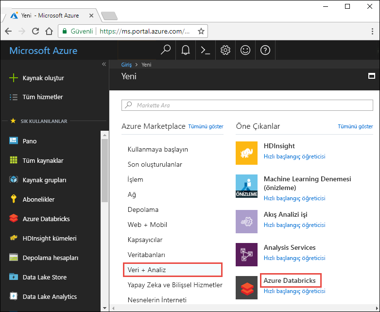
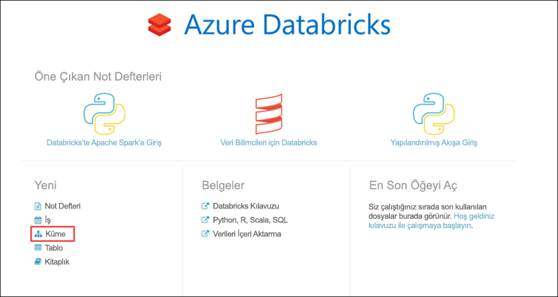
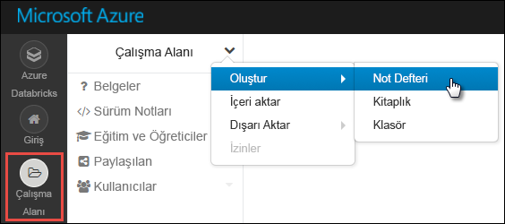
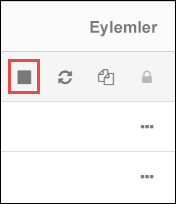

# <a name="tutorial-stream-data-into-azure-databricks-using-event-hubs"></a>Öğretici: Event Hubs kullanarak Azure Databricks’e veri akışı yapma

> [!IMPORTANT]
> Bu öğretici Azure Databricks Runtime 5,2 sürümü ile birlikte kullanılabilir.

Bu öğreticide bir veri alımı sistemini Azure Databricks’e bağlayarak gerçek zamanlıya yakın şekilde verileri bir Apache Spark kümesinde akışa alacaksınız. Azure Event Hubs kullanarak veri alımı sistemi oluşturacak ve sonra gelen iletileri işlemek üzere Azure Databricks’e bağlayacaksınız. Bir veri akışına erişmek için, Twitter API’lerini kullanarak tweet’leri Event Hubs’a alacaksınız. Verileri Azure Databricks’e aldıktan sonra daha ayrıntılı analiz etmek için analiz işleri gerçekleştirebilirsiniz.

Bu öğreticinin sonunda, Twitter’daki "Azure" terimini içeren tweet’leri akışa almış ve bu tweet’leri Azure Databricks’te okumuş olacaksınız.

Aşağıdaki şekilde uygulama akışı gösterilmektedir:


Bu öğretici aşağıdaki görevleri kapsar:

> [!div class="checklist"]
> * Azure Databricks çalışma alanı oluşturma
> * Azure Databricks’te Spark kümesi oluşturma
> * Akış verilerine erişmek için bir Twitter uygulaması oluşturma
> * Azure Databricks’te not defterleri oluşturma
> * Event Hubs ve Twitter API’si için kitaplıklar ekleme
> * Event Hubs’a tweet’ler gönderme
> * Event Hubs’tan tweet’leri okuma

Azure aboneliğiniz yoksa başlamadan önce [ücretsiz bir hesap](https://azure.microsoft.com/free/) oluşturun.

> [!Note]
> Bu öğretici **Azure Ücretsiz deneme aboneliği**kullanılarak gerçekleştirilemez.
> Ücretsiz hesabınız varsa, profilinize gidin ve aboneliğinizi **Kullandıkça Öde**ile değiştirin. Daha fazla bilgi için bkz. [Ücretsiz Azure hesabı](https://azure.microsoft.com/free/). Ardından, [harcama limitini kaldırın](https://docs.microsoft.com/azure/billing/billing-spending-limit#remove-the-spending-limit-in-account-center)ve bölgenizdeki vCPU 'lar için [bir kota artışı isteyin](https://docs.microsoft.com/azure/azure-supportability/resource-manager-core-quotas-request) . Azure Databricks çalışma alanınızı oluşturduğunuzda, çalışma alanına 14 gün boyunca ücretsiz Premium Azure Databricks DBUs erişimi sağlamak için **deneme (Premium-14 gün ücretsiz DBUs)** fiyatlandırma katmanını seçebilirsiniz.

## <a name="prerequisites"></a>Önkoşullar

Bu öğreticiye başlamadan önce aşağıdaki gereksinimlerin karşılandığından emin olun:
- Azure Event Hubs ad alanı.
- Ad alanı içinde bir Olay Hub’ı.
- Event Hubs ad alanına erişmek için bağlantı dizesi. Bağlantı dizesi şuna benzer bir biçimde olmalıdır: `Endpoint=sb://<namespace>.servicebus.windows.net/;SharedAccessKeyName=<key name>;SharedAccessKey=<key value>`.
- Event Hubs için paylaşılan erişim ilkesi adı ve ilke anahtarı.

[Azure Event Hubs ad alanı ve olay hub’ı oluşturma](../event-hubs/event-hubs-create.md) başlıklı makaledeki adımları tamamlayarak bu gereksinimleri karşılayabilirsiniz.

## <a name="sign-in-to-the-azure-portal"></a>Azure portalında oturum açın

[Azure Portal](https://portal.azure.com/)’ında oturum açın.

## <a name="create-an-azure-databricks-workspace"></a>Azure Databricks çalışma alanı oluşturma

Bu bölümde Azure portalını kullanarak bir Azure Databricks çalışma alanı oluşturursunuz.

1. Azure portalında **Kaynak oluşturun** > **Veri ve Analiz** > **Azure Databricks** seçeneklerini belirleyin.

    

3. **Azure Databricks Hizmeti** bölümünde, Databricks çalışma alanı oluşturmak için değerler sağlayın.

    

    Aşağıdaki değerleri sağlayın:

    |Özellik  |Açıklama  |
    |---------|---------|
    |**Çalışma alanı adı**     | Databricks çalışma alanınız için bir ad sağlayın        |
    |**Abonelik**     | Açılan listeden Azure aboneliğinizi seçin.        |
    |**Kaynak grubu**     | Yeni bir kaynak grubu oluşturmayı veya mevcut bir kaynak grubunu kullanmayı seçin. Kaynak grubu, bir Azure çözümü için ilgili kaynakları bir arada tutan kapsayıcıdır. Daha fazla bilgi için bkz. [Azure Kaynak Grubuna genel bakış](../azure-resource-manager/resource-group-overview.md). |
    |**Konum**     | **Doğu ABD 2**’yi seçin. Kullanılabilir diğer bölgeler için bkz. [Bölgeye göre kullanılabilir Azure hizmetleri](https://azure.microsoft.com/regions/services/).        |
    |**Fiyatlandırma Katmanı**     |  **Standart** veya **Premium** arasında seçim yapın. Bu katmanlar hakkında daha fazla bilgi için bkz. [Databricks fiyatlandırma sayfası](https://azure.microsoft.com/pricing/details/databricks/).       |

    **Panoya sabitle**’yi ve sonra **Oluştur**’u seçin.

4. Hesabın oluşturulması birkaç dakika sürer. Hesap oluşturma sırasında portal sağ tarafta **Azure Databricks için dağıtım gönderiliyor** kutucuğunu gösterir. Kutucuğu görmek için panonuzu sağa kaydırmanız gerekebilir. Ayrıca, ekranın üst kısmında gösterilen bir ilerleme çubuğu vardır. İlerleme durumu için her iki alanı da izleyebilirsiniz.

    

## <a name="create-a-spark-cluster-in-databricks"></a>Databricks’te Spark kümesi oluşturma

1. Azure portalında, oluşturduğunuz Databricks çalışma alanına gidin ve sonra **Çalışma Alanını Başlat**’ı seçin.

2. Azure Databricks portalına yönlendirilirsiniz. Portaldan **Küme**’yi seçin.

    

3. **Yeni küme** sayfasında, bir küme oluşturmak için değerleri girin.

    

    Aşağıdakiler dışında diğer tüm varsayılan değerleri kabul edin:

   * Küme için bir ad girin.
   * Bu makalede, **5,2** çalışma zamanına sahip bir küme oluşturun.
   * **\_\_ dakika işlem yapılmadığında sonlandır** onay kutusunu seçtiğinizden emin olun. Küme kullanılmazsa kümenin sonlandırılması için biz süre (dakika cinsinden) belirtin.

   Teknik ölçüt ve [Bütçe](https://azure.microsoft.com/en-us/pricing/details/databricks/)için uygun olan küme çalışanını ve sürücü düğümü boyutunu seçin.

     **Küme oluştur**’u seçin. Küme çalışmaya başladıktan sonra kümeye not defterleri ekleyebilir ve Spark işleri çalıştırabilirsiniz.

## <a name="create-a-twitter-application"></a>Twitter uygulaması oluşturma

Tweet’lerin akışını almak için Twitter’da bir uygulama oluşturursunuz. Yönergeleri izleyerek bir Twitter uygulaması oluşturun ve bu öğreticiyi tamamlamak için ihtiyaç duyduğunuz değerleri kaydedin.

1. Bir Web tarayıcısından, [geliştiriciler Için Twitter](https://developer.twitter.com/en/apps)' a gidin ve **uygulama oluştur**' u seçin. Twitter geliştirici hesabı için uygulamanız gerektiğini söyleyen bir ileti görebilirsiniz. Bu işlemi ücretsiz yapın ve uygulamanız onaylandıktan sonra bir onay e-postası görmeniz gerekir. Bir geliştirici hesabının onaylanması birkaç gün sürebilir.

    

2. **Uygulama oluşturun** sayfasında yeni uygulamaya ilişkin ayrıntıları sağlayın ve **Kendi Twitter uygulamanızı oluşturun**’u seçin.

    

    

3. Uygulama sayfasında **anahtarlar ve belirteçler** sekmesini seçin ve **Tüketici API anahtarı** ve **Tüketici API 'si gizli anahtarı**için değerleri kopyalayın. Ayrıca, erişim belirteçlerini oluşturmak için erişim belirteci altında **Oluştur** **ve erişim belirteci gizli anahtarı** ' nı seçin. **Erişim Belirteci** ve**Erişim Belirteci Parolası** değerlerini kopyalayın.

    

Twitter uygulaması için aldığınız değerleri kaydedin. Öğreticinin sonraki bölümlerinde bu değerlere ihtiyacınız olacaktır.

## <a name="attach-libraries-to-spark-cluster"></a>Spark kümesine kitaplıklar ekleme

Bu öğreticide, Event Hubs’a tweet’ler göndermek için Twitter API’lerini kullanırsınız. Azure Event Hubs’a verileri okuyup yazmak için de [Apache Spark Event Hubs bağlayıcısını](https://github.com/Azure/azure-event-hubs-spark) kullanırsınız. Kümenizin bir parçası olarak bu API 'Leri kullanmak için bunları Azure Databricks kitaplık olarak ekleyin ve Spark kümeniz ile ilişkilendirin. Aşağıdaki yönergeler bir kitaplığın nasıl ekleneceğini göstermektedir.

1. Azure Databricks çalışma alanında **kümeler**' ı seçin ve var olan Spark kümenizi seçin. Küme menüsünde **Kitaplıklar** ' ı seçin ve **Yeni**' ye tıklayın.

   

   

2. Yeni Kitaplık sayfasında, **kaynak** **Seç ' i seçin**. **Koordinat**için, eklemek istediğiniz paket Için **arama paketleri** ' ne tıklayın. Bu öğreticide kullanılan kitaplıklar için Maven koordinatları aşağıdaki gibidir:

   * Spark Event Hubs bağlayıcısı - `com.microsoft.azure:azure-eventhubs-spark_2.11:2.3.10`
   * Twitter API’si - `org.twitter4j:twitter4j-core:4.0.7`

     

     

3. **Yükle**’yi seçin.

4. Küme menüsünde, her iki kitaplıkların de yüklendiğinden ve doğru şekilde eklendiğinden emin olun.

    

6. Twitter paketi için şu adımları yineleyin, `twitter4j-core:4.0.7`.

## <a name="create-notebooks-in-databricks"></a>Databricks’te not defterleri oluşturma

Bu bölümde, Databricks çalışma alanında aşağıdaki adlarla iki not defteri oluşturacaksınız:

- **SendTweetsToEventHub** - Bu, Twitter’dan tweet’ler almak ve bunları Event Hubs’ta akışa almak için kullandığınız bir üretici not defteridir.
- **ReadTweetsFromEventHub** - Event Hubs’tan tweetleri okumak için kullandığınız bir tüketici not defteri.

1. Sol bölmede **Çalışma Alanı**’nı seçin. **Çalışma Alanı** açılır listesinden **Oluştur** > **Not Defteri**’ni seçin.

    

2. **Not Defteri Oluştur** iletişim kutusuna **SendTweetsToEventHub** girin, dil olarak **Scala**’yı seçin ve daha önce oluşturduğunuz Spark kümesini seçin.

    

    **Oluştur**'u seçin.

3. **ReadTweetsFromEventHub** not defterini oluşturma adımlarını yineleyin.

## <a name="send-tweets-to-event-hubs"></a>Event Hubs’a tweet’ler gönderme

**Sendtweetstoeventhub** not defterine aşağıdaki kodu yapıştırın ve yer tutucuları, daha önce oluşturduğunuz Event Hubs ad alanı ve Twitter uygulamanızın değerleriyle değiştirin. Bu not defteri, gerçek zamanlı olarak "Azure" anahtar sözcüğünü içeren tweet’leri Event Hubs’ta akışa alır.

> [!NOTE]
> Twitter API 'SI belirli istek kısıtlamalarına ve [kotalara](https://developer.twitter.com/en/docs/basics/rate-limiting.html)sahiptir. Twitter API 'sinde standart fiyat sınırlandırmasını tatmin ediyorsanız, bu örnekte Twitter API 'sini kullanmadan metin içeriği oluşturabilirsiniz. Bunu yapmak için, değişken **veri kaynağını** `twitter` yerine `test` olarak ayarlayın ve **TestSource** listesini tercih edilen test girişi ile doldurun.

```scala
    import scala.collection.JavaConverters._
    import com.microsoft.azure.eventhubs._
    import java.util.concurrent._
    import scala.collection.immutable._
    import scala.concurrent.Future
    import scala.concurrent.ExecutionContext.Implicits.global

    val namespaceName = "<EVENT HUBS NAMESPACE>"
    val eventHubName = "<EVENT HUB NAME>"
    val sasKeyName = "<POLICY NAME>"
    val sasKey = "<POLICY KEY>"
    val connStr = new ConnectionStringBuilder()
                .setNamespaceName(namespaceName)
                .setEventHubName(eventHubName)
                .setSasKeyName(sasKeyName)
                .setSasKey(sasKey)

    val pool = Executors.newScheduledThreadPool(1)
    val eventHubClient = EventHubClient.create(connStr.toString(), pool)

    def sleep(time: Long): Unit = Thread.sleep(time)

    def sendEvent(message: String, delay: Long) = {
      sleep(delay)
      val messageData = EventData.create(message.getBytes("UTF-8"))
      eventHubClient.get().send(messageData)
      System.out.println("Sent event: " + message + "\n")
    }

    // Add your own values to the list
    val testSource = List("Azure is the greatest!", "Azure isn't working :(", "Azure is okay.")

    // Specify 'test' if you prefer to not use Twitter API and loop through a list of values you define in `testSource`
    // Otherwise specify 'twitter'
    val dataSource = "test"

    if (dataSource == "twitter") {

      import twitter4j._
      import twitter4j.TwitterFactory
      import twitter4j.Twitter
      import twitter4j.conf.ConfigurationBuilder

      // Twitter configuration!
      // Replace values below with you

      val twitterConsumerKey = "<CONSUMER API KEY>"
      val twitterConsumerSecret = "<CONSUMER API SECRET>"
      val twitterOauthAccessToken = "<ACCESS TOKEN>"
      val twitterOauthTokenSecret = "<TOKEN SECRET>"

      val cb = new ConfigurationBuilder()
        cb.setDebugEnabled(true)
        .setOAuthConsumerKey(twitterConsumerKey)
        .setOAuthConsumerSecret(twitterConsumerSecret)
        .setOAuthAccessToken(twitterOauthAccessToken)
        .setOAuthAccessTokenSecret(twitterOauthTokenSecret)

      val twitterFactory = new TwitterFactory(cb.build())
      val twitter = twitterFactory.getInstance()

      // Getting tweets with keyword "Azure" and sending them to the Event Hub in realtime!
      val query = new Query(" #Azure ")
      query.setCount(100)
      query.lang("en")
      var finished = false
      while (!finished) {
        val result = twitter.search(query)
        val statuses = result.getTweets()
        var lowestStatusId = Long.MaxValue
        for (status <- statuses.asScala) {
          if(!status.isRetweet()){
            sendEvent(status.getText(), 5000)
          }
          lowestStatusId = Math.min(status.getId(), lowestStatusId)
        }
        query.setMaxId(lowestStatusId - 1)
      }

    } else if (dataSource == "test") {
      // Loop through the list of test input data
      while (true) {
        testSource.foreach {
          sendEvent(_,5000)
        }
      }

    } else {
      System.out.println("Unsupported Data Source. Set 'dataSource' to \"twitter\" or \"test\"")
    }

    // Closing connection to the Event Hub
    eventHubClient.get().close()
```

Not defterlerini çalıştırmak için **SHIFT + ENTER** tuşlarına basın. Aşağıdaki kod parçacığına benzer bir çıktı görürsünüz. Çıktıdaki her olay, Event Hubs’a alınan ve “Azure” terimini içeren bir tweet’tir.

    Sent event: @Microsoft and @Esri launch Geospatial AI on Azure https://t.co/VmLUCiPm6q via @geoworldmedia #geoai #azure #gis #ArtificialIntelligence

    Sent event: Public preview of Java on App Service, built-in support for Tomcat and OpenJDK
    https://t.co/7vs7cKtvah
    #cloudcomputing #Azure

    Sent event: 4 Killer #Azure Features for #Data #Performance https://t.co/kpIb7hFO2j by @RedPixie

    Sent event: Migrate your databases to a fully managed service with Azure SQL Database Managed Instance | #Azure | #Cloud https://t.co/sJHXN4trDk

    Sent event: Top 10 Tricks to #Save Money with #Azure Virtual Machines https://t.co/F2wshBXdoz #Cloud

    ...
    ...

## <a name="read-tweets-from-event-hubs"></a>Event Hubs’tan tweet’leri okuma

**ReadTweetsFromEventHub** not defterine aşağıdaki kodu yapıştırın ve yer tutucuyu, daha önce oluşturduğunuz Azure Event Hubs değerleriyle değiştirin. Bu not defteri, **SendTweetsToEventHub** not defterini kullanarak önceden Event Hubs’ta akışa alınan tweet’leri okur.

```scala

    import org.apache.spark.eventhubs._
    import com.microsoft.azure.eventhubs._

    // Build connection string with the above information
    val namespaceName = "<EVENT HUBS NAMESPACE>"
    val eventHubName = "<EVENT HUB NAME>"
    val sasKeyName = "<POLICY NAME>"
    val sasKey = "<POLICY KEY>"
    val connStr = new com.microsoft.azure.eventhubs.ConnectionStringBuilder()
                .setNamespaceName(namespaceName)
                .setEventHubName(eventHubName)
                .setSasKeyName(sasKeyName)
                .setSasKey(sasKey)

    val customEventhubParameters =
      EventHubsConf(connStr.toString())
      .setMaxEventsPerTrigger(5)

    val incomingStream = spark.readStream.format("eventhubs").options(customEventhubParameters.toMap).load()

    incomingStream.printSchema

    // Sending the incoming stream into the console.
    // Data comes in batches!
    incomingStream.writeStream.outputMode("append").format("console").option("truncate", false).start().awaitTermination()
```

Aşağıdaki çıkışı alırsınız:


    root
     |-- body: binary (nullable = true)
     |-- offset: long (nullable = true)
     |-- seqNumber: long (nullable = true)
     |-- enqueuedTime: long (nullable = true)
     |-- publisher: string (nullable = true)
     |-- partitionKey: string (nullable = true)

    -------------------------------------------
    Batch: 0
    -------------------------------------------
    +------+------+--------------+---------------+---------+------------+
    |body  |offset|sequenceNumber|enqueuedTime   |publisher|partitionKey|
    +------+------+--------------+---------------+---------+------------+
    |[50 75 62 6C 69 63 20 70 72 65 76 69 65 77 20 6F 66 20 4A 61 76 61 20 6F 6E 20 41 70 70 20 53 65 72 76 69 63 65 2C 20 62 75 69 6C 74 2D 69 6E 20 73 75 70 70 6F 72 74 20 66 6F 72 20 54 6F 6D 63 61 74 20 61 6E 64 20 4F 70 65 6E 4A 44 4B 0A 68 74 74 70 73 3A 2F 2F 74 2E 63 6F 2F 37 76 73 37 63 4B 74 76 61 68 20 0A 23 63 6C 6F 75 64 63 6F 6D 70 75 74 69 6E 67 20 23 41 7A 75 72 65]                              |0     |0             |2018-03-09 05:49:08.86 |null     |null        |
    |[4D 69 67 72 61 74 65 20 79 6F 75 72 20 64 61 74 61 62 61 73 65 73 20 74 6F 20 61 20 66 75 6C 6C 79 20 6D 61 6E 61 67 65 64 20 73 65 72 76 69 63 65 20 77 69 74 68 20 41 7A 75 72 65 20 53 51 4C 20 44 61 74 61 62 61 73 65 20 4D 61 6E 61 67 65 64 20 49 6E 73 74 61 6E 63 65 20 7C 20 23 41 7A 75 72 65 20 7C 20 23 43 6C 6F 75 64 20 68 74 74 70 73 3A 2F 2F 74 2E 63 6F 2F 73 4A 48 58 4E 34 74 72 44 6B]            |168   |1             |2018-03-09 05:49:24.752|null     |null        |
    +------+------+--------------+---------------+---------+------------+

    -------------------------------------------
    Batch: 1
    -------------------------------------------
    ...
    ...

Çıkış ikili modda olduğundan, bunu dizeye dönüştürmek için aşağıdaki kod parçacığını kullanın.

```scala
    import org.apache.spark.sql.types._
    import org.apache.spark.sql.functions._

    // Event Hub message format is JSON and contains "body" field
    // Body is binary, so we cast it to string to see the actual content of the message
    val messages =
      incomingStream
      .withColumn("Offset", $"offset".cast(LongType))
      .withColumn("Time (readable)", $"enqueuedTime".cast(TimestampType))
      .withColumn("Timestamp", $"enqueuedTime".cast(LongType))
      .withColumn("Body", $"body".cast(StringType))
      .select("Offset", "Time (readable)", "Timestamp", "Body")

    messages.printSchema

    messages.writeStream.outputMode("append").format("console").option("truncate", false).start().awaitTermination()
```

Çıkış şimdi aşağıdaki kod parçacığına benzer:

    root
     |-- Offset: long (nullable = true)
     |-- Time (readable): timestamp (nullable = true)
     |-- Timestamp: long (nullable = true)
     |-- Body: string (nullable = true)

    -------------------------------------------
    Batch: 0
    -------------------------------------------
    +------+-----------------+----------+-------+
    |Offset|Time (readable)  |Timestamp |Body
    +------+-----------------+----------+-------+
    |0     |2018-03-09 05:49:08.86 |1520574548|Public preview of Java on App Service, built-in support for Tomcat and OpenJDK
    https://t.co/7vs7cKtvah
    #cloudcomputing #Azure          |
    |168   |2018-03-09 05:49:24.752|1520574564|Migrate your databases to a fully managed service with Azure SQL Database Managed Instance | #Azure | #Cloud https://t.co/sJHXN4trDk    |
    |0     |2018-03-09 05:49:02.936|1520574542|@Microsoft and @Esri launch Geospatial AI on Azure https://t.co/VmLUCiPm6q via @geoworldmedia #geoai #azure #gis #ArtificialIntelligence|
    |176   |2018-03-09 05:49:20.801|1520574560|4 Killer #Azure Features for #Data #Performance https://t.co/kpIb7hFO2j by @RedPixie                                                    |
    +------+-----------------+----------+-------+
    -------------------------------------------
    Batch: 1
    -------------------------------------------
    ...
    ...

İşte bu kadar! Azure Databricks kullanarak gerçek zamanlıya yakın şekilde verileri başarıyla Azure Event Hubs’ta akışa aldınız Daha sonra Apache Spark için Event Hubs bağlayıcısını kullanarak akış verilerini kullandınız. Spark için Event Hubs bağlayıcısını kullanma hakkında daha fazla bilgi için [bağlayıcı belgesi](https://github.com/Azure/azure-event-hubs-spark/tree/master/docs)ne başvurun.

## <a name="clean-up-resources"></a>Kaynakları temizleme

Öğreticiyi çalıştırdıktan sonra kümeyi sonlandırabilirsiniz. Bunu yapmak için Azure Databricks çalışma alanında sol bölmedeki **Kümeler**’i seçin. Sonlandırmak istediğiniz küme için imleci **Eylemler** sütunu altındaki üç noktanın üzerine taşıyın ve **Sonlandır** simgesini seçin.



Bu kümeyi el ile sonlandıramazsanız, kümeyi oluştururken **\_ sonra Sonlandır** onay kutusunu \_, sonra da Durdur seçeneğini belirlediyseniz, otomatik olarak durdurulur. Böyle bir durumda, belirtilen süre boyunca etkin olmaması durumunda küme otomatik olarak durdurulur.

## <a name="next-steps"></a>Sonraki adımlar
Bu öğreticide, şunların nasıl yapıldığını öğrendiniz:

> [!div class="checklist"]
> * Azure Databricks çalışma alanı oluşturma
> * Azure Databricks’te Spark kümesi oluşturma
> * Akış verileri oluşturmak için bir Twitter uygulaması oluşturma
> * Azure Databricks’te not defterleri oluşturma
> * Event Hubs ve Twitter API’si için kitaplıklar ekleme
> * Event Hubs’a tweet’ler gönderme
> * Event Hubs’tan tweet’leri okuma

Azure Databricks ve bilişsel [Hizmetler API 'si](../cognitive-services/text-analytics/overview.md)kullanarak akışlı veriler üzerinde yaklaşım Analizi gerçekleştirme hakkında bilgi edinmek için sonraki öğreticiye ilerleyin.

> [!div class="nextstepaction"]
>[Azure Databricks kullanarak akış verileri üzerinde yaklaşım Analizi](databricks-sentiment-analysis-cognitive-services.md)
